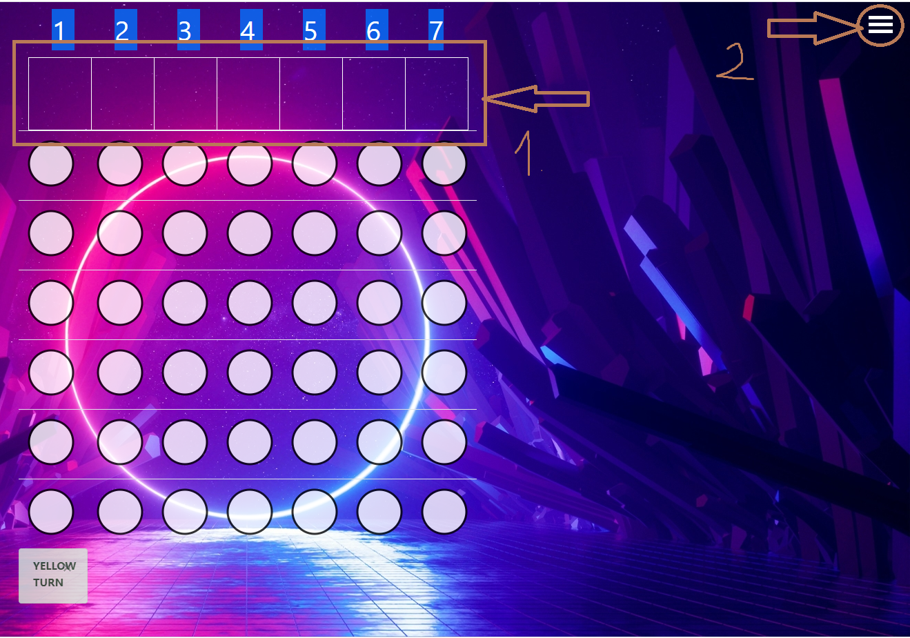

#Note: This is only a University Project

Use it with gradle.

# Connect Four

				
## Inhaltsverzeichnis
- [Einleitung](#Einleitung)
- [Spielregeln](#Spielregeln)
- [Bedienungsanleitung](#Bedienungsanleitung)
- [Dateiübersicht](#Dateiübersicht)
- [Spiel-Engine](#Spiel-Engine)
- [Tests](#Tests)
- [Umsetzung der GUI](#Umsetzung-der-GUI)
- [Hinweise](#Hinweise)
- [Quellen](#Quellen)

------
## Einleitung
------
[Vier gewinnt](https://de.wikipedia.org/wiki/Vier_gewinnt) ist ein Zweipersonen-Strategiespiel 
mit dem Ziel, als Erster vier der eigenen Spielsteine in eine Linie zu bringen

## Spielregeln
------
Das Spiel wird auf einem senkrecht stehenden hohlen Spielbrett gespielt, in das die Spieler abwechselnd ihre Spielsteine fallen lassen. 
Das Spielbrett besteht aus sieben Spalten (senkrecht) und sechs Reihen (waagerecht).
Gewinner ist der Spieler, der es als erster schafft, vier oder mehr seiner Spielsteine waagerecht, senkrecht oder diagonal in eine Linie zu bringen.

------
## Bedienungsanleitung
----

### Hauptmenü
Der Spieler wird auf einen Homepage Seite geführt.

Der Spieler kann 3 Optionen wählen:

- **1. Play** -> Der Spieler wird auf die Spiel Seite umgeleitet und er kann sofort das Spiel spielen.

- **2. Select Player** -> Der Spieler kann hier auswählen ob er als Player 1(Spieler beginnt) oder Player 2(Bot beginnt) spielen möchte.

- **3. Options** -> Der Spieler kann auswählen, ob er gegen Monte-Carlo-Tree-Search als Gegenspieler haben möchte oder Minimax als Gegenspieler.(Bitte doppelt Klicken)

### Spiel
Hat der Spieler auf Play gedrückt, gelangt er zu das Spiel.
Um zu spielen braucht der Spieler nur oben auf dieser Reihe zu Klicken(siehe Anhang - Nr.1).
Hat der Spieler auf einer Reihe geklickt so erscheint ein Stein in das Spielbrett.

Bitte Beachte, dass man nicht zu schnell oder doppel Klicken darf(nur bei Minimax), weil du sonst für den Minimax spielst, falls er noch rechnet.

### Navigationsbar
Die Navigationsbar befindet sich oben rechts(siehe Anhang - Nr.2). Klickt man auf das Symbol drauf erscheint ein Menü.

In den Menü kannst du 5 verschiedene Buttons drücken:

1. Mache deine letzten Zug rückgängig(Undo Move)

2. Starte ein neues Spiel (Reset)

3. Lasse Monte-Carlo für dich einen Zug machen(Best Move)

4. Gehe zurück zum Hauptmenü(Home)

5. Kannst du die verschiedene Testfälle austesten.

Anhang : 

---

## Quellen
---

Bitboard : https://github.com/qu1j0t3/fhourstones/blob/master/Connect4.java

Bitboard : https://github.com/denkspuren/BitboardC4/blob/master/BitboardDesign.md

Bitboard : https://github.com/tromp/fhourstones88/blob/master/Game.h 

Monte-Carlo-Tree-Search : https://www.youtube.com/watch?v=CjldSexfOuU&t=709s

Zobrist Hashing: https://en.wikipedia.org/wiki/Zobrist_hashing

Zobrist Hashing: http://nedrilad.com/Tutorial/topic-67/Artificial-Intelligence-for-Games-711.html
